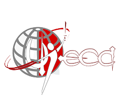

<!DOCTYPE html>
<html lang="es">
<head>
<meta charset="UTF-8">
<meta name="viewport" content="width=device-width, initial-scale=1.0">
<title>Acceso | Congreso Trascendentales 2026</title>
<link rel="preconnect" href="https://fonts.googleapis.com">
<link rel="preconnect" href="https://fonts.gstatic.com" crossorigin>
<link href="https://fonts.googleapis.com/css2?family=Outfit:wght@300;400;500;600;700;800;900&display=swap" rel="stylesheet">

</head>
<body>
<main class="shell">
  <section class="layout" id="loader">
    <article class="hero">
      

        
        
Circuito 2 · Zona 6

      

      

        
Congreso Juvenil 2026

        <h1>Trascendentales</h1>
        

        
Una apertura visual pensada para marcar el tono del congreso desde el primer segundo: más carácter, más identidad y una experiencia mejor cuidada para recibir a cada inscrito.

        

          

            
🗓️

            Fecha
            <strong>5 al 8 de diciembre de 2026</strong>
          

          

            
📍

            Lugar
            <strong>Cerizim - Sincelejo</strong>
          

          

            
✝

            Lema
            <strong>Fe + Acción</strong>
          

        

        

          <a href="form.html" class="cta-button">INSCRIBETE HOY</a>
          
Únete a cientos de jóvenes que vivirán esta experiencia única

        

      

      

  

    

      

        <!-- Calendar -->
        <svg xmlns="http://www.w3.org/2000/svg" width="22" height="22" fill="none" stroke="currentColor" stroke-width="2" stroke-linecap="round" stroke-linejoin="round">
          <rect x="3" y="4" width="18" height="18" rx="2"></rect>
          <line x1="16" y1="2" x2="16" y2="6"></line>
          <line x1="8" y1="2" x2="8" y2="6"></line>
          <line x1="3" y1="10" x2="21" y2="10"></line>
        </svg>
      

      

        Fecha
        <strong>5 al 8 de diciembre de 2026</strong>
      

    

    

      

        <!-- Location -->
        <svg xmlns="http://www.w3.org/2000/svg" width="22" height="22" fill="none" stroke="currentColor" stroke-width="2" stroke-linecap="round" stroke-linejoin="round">
          <path d="M12 21s7-5.5 7-11a7 7 0 1 0-14 0c0 5.5 7 11 7 11z"></path>
          <circle cx="12" cy="10" r="3"></circle>
        </svg>
      

      

        Lugar
        <strong>Cerizim - Sincelejo, Unidad zonal Enea</strong>
      

    

    

      

        <!-- Users -->
        <svg xmlns="http://www.w3.org/2000/svg" width="22" height="22" fill="none" stroke="currentColor" stroke-width="2" stroke-linecap="round" stroke-linejoin="round">
          <path d="M17 21v-2a4 4 0 0 0-3-3.87"></path>
          <path d="M9 21v-2a4 4 0 0 1 3-3.87"></path>
          <circle cx="12" cy="7" r="4"></circle>
        </svg>
      

      

        Invita
        <strong>Circuito 2 - Zona 6 Iglesia Cristiana Shekinah</strong>
      

    

  

    </article>

    <aside class="status-panel">
      

        

          

          
🛡 Acceso oficial

        

        

          <h2>Preparando la plataforma del congreso</h2>
          
Estamos cargando la experiencia de registro, pagos, consulta y control general del evento. Todo se está organizando para que el ingreso sea rápido y claro.

        

        

          <small>Estado del sistema</small>
          

          
Iniciando...

          

          

            Sincronizando módulos
            <strong id="porcentaje">0%</strong>
          

        

        

          

            
01

            

              <strong>Identidad del congreso</strong>
              Se carga el entorno visual oficial para conservar coherencia con el afiche y el lema del evento.
            

          

          

            
02

            

              <strong>Registro y consultas</strong>
              Se preparan los formularios, el listado de inscritos y la conexión con la base del congreso.
            

          

          

            
03

            

              <strong>Ingreso al panel principal</strong>
              Al finalizar la carga te llevamos automáticamente a la página inicial del sistema.
            

          

        

      

      

        <strong>¿Necesitas ayuda?</strong>
        Escríbenos y te asistimos en el proceso.
      

    </aside>
  </section>
</main>

</body>
</html>
