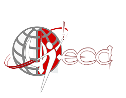

<!DOCTYPE html>
<html lang="es">
<head>
  <meta charset="UTF-8">
  <meta name="viewport" content="width=device-width, initial-scale=1.0">
  <meta name="theme-color" content="#001b46">
  <title>Sistema en mantenimiento | UJECA</title>
  <link rel="preconnect" href="https://fonts.googleapis.com">
  <link rel="preconnect" href="https://fonts.gstatic.com" crossorigin>
  <link href="https://fonts.googleapis.com/css2?family=Outfit:wght@300;400;500;600;700;800;900&display=swap" rel="stylesheet">
  <link rel="icon" type="image/png" href="img/logo.png">
  
</head>
<body>
  <main class="maintenance" aria-labelledby="titulo-mantenimiento">
    <section class="main-panel">
      

        

          
        

        

        

          <strong>UJECA</strong>
          Congreso Trascendentales 2026
        

      

      

        ⚙
        Sistema en mantenimiento
      

      

        

          <h1 id="titulo-mantenimiento">Mejorando la plataforma</h1>
          

        

        

          

          

          

            

          

          

        

      

      

        Estamos haciendo ajustes técnicos para ofrecer un sistema más seguro, estable y fácil de usar.
      

      

        

          

            <svg viewBox="0 0 24 24"><path d="M12 3 5 6v5c0 4.6 3 8 7 10 4-2 7-5.4 7-10V6l-7-3Z"></path></svg>
          

          Estado
          <strong>Actualización en proceso</strong>
        

        

          

            <svg viewBox="0 0 24 24"><path d="M8 2v4"></path><path d="M16 2v4"></path><path d="M4 9h16"></path><rect x="4" y="5" width="16" height="16" rx="2"></rect><path d="M8 13h3"></path><path d="M13 13h3"></path><path d="M8 17h3"></path><path d="M13 17h3"></path></svg>
          

          Datos
          <strong>Información resguardada</strong>
        

        

          

            <svg viewBox="0 0 24 24"><rect x="5" y="10" width="14" height="10" rx="2"></rect><path d="M8 10V7a4 4 0 0 1 8 0v3"></path><path d="M12 14v2"></path></svg>
          

          Acceso
          <strong>Acceso pausado</strong>
        

      

    </section>

    <aside class="side-panel" aria-label="Información del proceso">
      

        
Mantenimiento programado

        <h2>Una versión más clara y rápida viene en camino.</h2>
        

          Estamos preparando todo para continuar los procesos del Congreso con mayor estabilidad.
        

      

      

        

          ⚙
          Optimización del sistema
          En progreso
        

        

          

            
          

          70%
        

      

      

        i
        

          No necesitas realizar ninguna acción. Esta pantalla es solo informativa.
        

      

      
Juntos en una misma visión

    </aside>
  </main>
</body>
</html>
